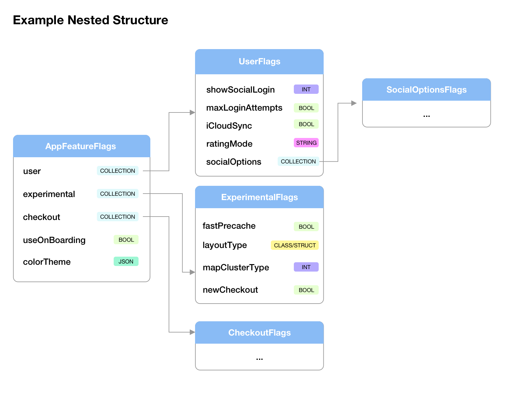

[↑ DOCUMENTATION INDEX](./../README.md#documentation)
# 2. Organize Feature Flags

- 2.1 - [The `@FlagCollection` annotation](#21-the-flagcollection-annotation)
- 2.2 - [Nested Structures](#22-nested-structures)
- 2.3 - [Configure `FlagCollection`'s contribution to properties keypath generation](#23-configure-flagcollections-contribution-to-properties-keypath-generation)

<a name="#2.1"/>

## 2.1. The `@FlagCollection` annotation

IndomioFlags allows you to describe complex nested structure for flags. You can, for example, create a collection inside another collection and create a data tree for feature flags which better describe your application's requirements.

In order to define a sub-collection inside a root structure (a `FlagCollectionProtocol` conform object) you must use the `@FlagProtocol`: it allows you to identify another `FlagCollectionProtocol` collection.

Consider the following example:

```swift
struct AppFeatureFlags: FlagCollectionProtocol {
    // ...
    @FlagCollection(description: "Checkout Flags")
    var checkout: CheckoutFlags
    // ...
}
```

The `checkout` variable referes to another sub collection named `CheckoutFlags`:

```swift
struct CheckoutFlags: FlagCollectionProtocol {
    // ...
}
```

Once loaded you can use the dot notation to explore data in type-safe manner:

```swift
if appFlags.checkout.someProperty == "..." { ... }
```

A structure may contains subcollections and properties as you wish.

[↑ INDEX](##2-organize-feature-flags)

## 2.2. Nested Structures

While IndomioFlags leave you free to organize your feature flags the library's architecture itself encourage you to classify feature flags and group them according to your criteria.  
You can stay flat or you can create nested categories. 

A single struct conforms to `FlagCollectionProtocol` may contains both properties and other collections.

Consider the following example:



We have created a nested structure where the root is `AppFeatureFlags`.  
We can translate the following tree in IndomioFlags as follow *(not all properties are exposed for brevity)*:

```swift

struct AppFeatureFlags: FlagCollectionProtocol {
    @FlagCollection(description: "User's Related Flags")
    var user: UserFlags
    
    @FlagCollection(description: "Experimental Flags")
    var experimental: ExperimentalFlags

    @FlagCollection(description: "Checkout Flags")
    var checkout: CheckoutFlags

    @FlagCollection(description: "Color Themen")
    var colorTheme: JSONData?
}

struct UserFlags: FlagCollectionProtocol {
    @Flag(default: false, description: "Show Social Login Button")
    var showSocialLogin: Bool
    // ...
}

struct ExperimentalFlags: FlagCollectionProtocol {
    @Flag(default: false, description: "New cool cache algorithm")
    var enableFastPrecache: Bool
    
    @Flag(key: "list_layout", default: nil, description: "Layout settings (JSON)")
    var listLayoutSettings: JSONData?
}

struct CheckoutFlags: FlagCollectionProtocol {
    // ...
}
```

Now you have created the structure you can easily load the structure in a `FlagsLoader` instance and query their values with typesafe:

```swift
let appFlags = FlagsLoader(AppFeatureFlags.self, providers: [localProvider])

/// Somewhere in your code you can query a nested value
if appFlags.userFlags.showSocialLogin {
    // ...
}
```

[↑ INDEX](##2-organize-feature-flags)

## 2.3 Configure `FlagCollection`'s contribution to properties keypath generation

Sometimes you may want to organize a collection of flags by creating nested structures which are transparent to the keypath generation to its inner properties.

Consider the following example with a `FlagLoader` with the default key configuration:

```swift
private struct TestFlags: FlagCollectionProtocol {
    @FlagCollection(description: "Group 1")
    var firstGroup: FirstGroup

    @Flag(default: false, description: "Top level test flag")
    var topLevelFlag: Bool
}

private struct FirstGroup: FlagCollectionProtocol {
    @Flag(default: false, description: "Second level test flag")
    var secondLevelFlag: Bool
}
````

You may want both `topLevelFlag` and `secondLevelFlag` contains the same keypath components.  
By now you will get the following keypaths:
- `topLevelFlag`: `top-level-flag`
- `secondLevelFlag`: `first-group/second-level-flag`

While you want to ignore `first-group` path component.

In order to accomplish this requirement you need to specify a `keyConfiguration` to the `FirstGroup`:

```swift
@FlagCollection(keyConfiguration: .skip, description: "Group 1")
var firstGroup: FirstGroup
```

`.skip` allows you to ignore the `firstGroup` property to the contribution of keypath.

Allowed transformations are pretty similar to the `keyConfiguration` of the `@Flag` property wrapper. They are:

- `default`: this is the default behaviour, it just uses the parent's `FlagLoader`'s `keyConfiguration` setting.
- `kebabCase`:  refers to the style of writing in which each space is replaced by a `-` character. It uses the kebab case with the current property key (`first-group/...`)
- `snakeCase`: refers to the style of writing in which each space is replaced by a `_` character. It uses the snake case with the current property key (`first_group/...`)
- `skip`: ignore the current's collection contribution to keypath generation.
- `custom(String)`: uses a fixed value to describe the current keypath component.

[↑ INDEX](##2-organize-feature-flags)
